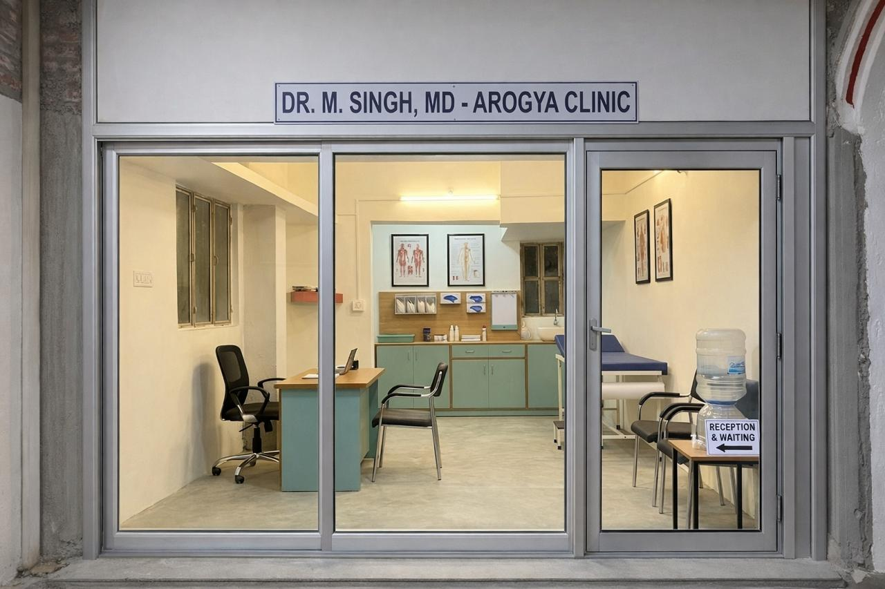

# Arogya Clinic - Dr. Deepak Kumar

A modern, high-performance web presence for **Arogya Clinic**, led by **Dr. Deepak Kumar (MD Medicine)**. This platform is designed to provide patients in Muzaffarpur and the Tirhut division with a seamless experience to learn about specialized medical services and schedule consultations.



## 🩺 Clinical Profile

- **Practitioner:** Dr. Deepak Kumar, MD Medicine (DMCH, Darbhanga), MBBS (SKMCH, Muzaffarpur)
- **Slogan:** *“Aapka Swasthya Hamari Jimmedari”* (Your Health, Our Responsibility)
- **Specializations:** 
  - Diabetes & Blood Pressure Management
  - Endocrine Care (Thyroid)
  - Respiratory Health (Asthma & COPD)
  - Abdominal & Gastrointestinal Diseases
  - Comprehensive Clinical Diagnostics
- **Clinic Timing:** Evening Clinic starts at **8:30 PM**
- **Contact:** +91 74888 78725
- **Location:** Muzaffarpur, Bihar

## 🚀 Features

- **Modern UI/UX:** Built with React and Tailwind CSS, following a "Premium Editorial" design language.
- **Localized Content:** Specifically tailored for the Muzaffarpur community with cultural references to North Bihar.
- **Service Catalog:** Detailed breakdown of specialized medical treatments.
- **Appointment Portal:** Integrated form for patients to request visits or teleconsultations.
- **Responsive Design:** Fully optimized for mobile, tablet, and desktop viewing.

## 🛠️ Technology Stack

- **Frontend:** React (Vite)
- **Styling:** Tailwind CSS
- **Icons:** Material Symbols (Google Fonts)
- **Routing:** React Router DOM
- **Deployment Ready:** Optimized build process for production environments.

## 📁 Project Structure

```text
Doctors_Profile/
├── FE/                 # Frontend React Application
│   ├── src/
│   │   ├── assets/     # Images and static resources
│   │   ├── components/ # Reusable UI components (Layout, etc.)
│   │   └── pages/      # Page components (Home, About, Services, etc.)
│   ├── tailwind.config # Custom design system tokens
│   └── vite.config     # Build configurations
├── BE/                 # Backend APIs (Coming Soon)
└── stitch/             # Original UI design exports and metadata
```

## ⚙️ Development Setup

### Prerequisites
- Node.js (v18+)
- npm

### Installation & Execution
1. Navigate to the frontend directory:
   ```bash
   cd FE
   ```
2. Install dependencies:
   ```bash
   npm install
   ```
3. Start the development server:
   ```bash
   npm run dev
   ```

---
*Developed with ❤️ for the healthcare community of Muzaffarpur.*
